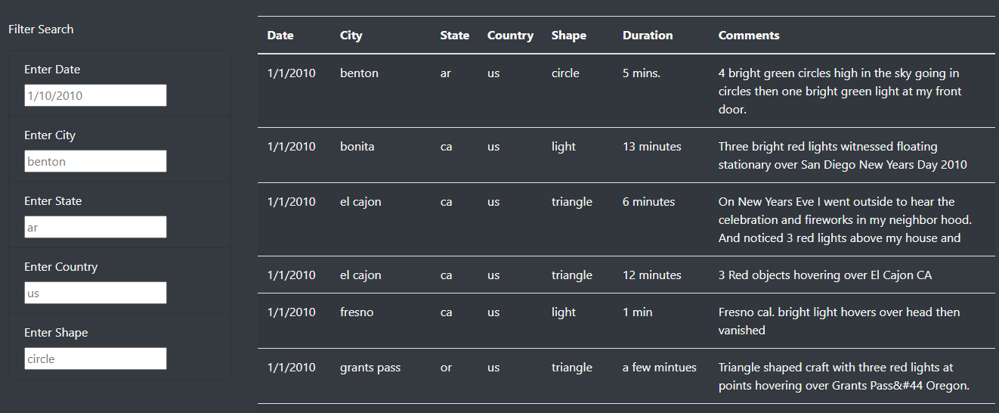
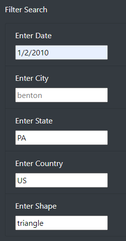

# UFO Analysis

A project using javascript and HTML to create a functioning website.

## Overview of Project

In this project we were to create a website that would be able to provide an in-depth look at reported UFO sightings. We were to add different filters, including the date, the city, state, country, and shape of UFO that was reported.

## Results
We have many results from out data file, and now with the website - the goal is to make them fileterable across the many filters. Below is an image for reference, and you can see where you will be able to filter by the filters on the left. You can add just one filter, or you can add multiple. 

You can add just one filter, or you can add multiple as seen below. If it is a grayed out box, for example if you do not know or want to filter by city - you can leave it blank.  

## Summary

One drawback of the website is it is majority just one color, and the grid it returns is a bit monotonous.

A couple ways to improve the website would be to formally Capitalize the States, Cities, and Countries to make it look a bit neater. 

You can also add perhaps a search box for the comments section. We would have to use some sort of a finder within comments to parse through the text and find matches. 

